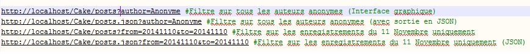

# Test Développeur iAdvize avec CakePHP

## Installation

1. Le développement a été réalisé avec [#WAMP] (http://www.wampserver.com/) pour la gestion du serveur et de la base de données
2. Penser à bien activer URL rewriting (Sous WAMP  : Apache > Apache module > rewrite_module)
3. Vérifier que la page de configuration CakePHP n'affiche aucun message d'erreur : [http://localhost/Cake/index.php](http://localhost/Cake/index.php)
4. Importer le script de création de table [posts] (posts.sql) dans une base de données appelée "iadvize" 
(vous pouvez reconfigurer toutes les informations MySQL dans app/Config/database.php)

## Utilisation
1. Vous pouvez lancer la récupération, l'affichage ou encore la suppression par ligne de commande via CURL
[]

2. Bien entendu, toutes ces fonctionnalités sont disponibles avec une l'interface graphique de Cake plus élaborée 
(Testé sous navigateur Firefox et Chrome : [http://localhost/Cake/posts](http://localhost/Cake/posts)

3. Il est possible d'utiliser l'API comme indiqué (quelques exemples ci-dessous)
[]

## Divers
1. Les dépendances du mini projet ont été gérées avec Composer (cf. Composer.json dans le répertoire app/)
2. Les tests PHPUnit sont disponibles sous [http://localhost/Cake/test.php] (http://localhost/Cake/test.php)
